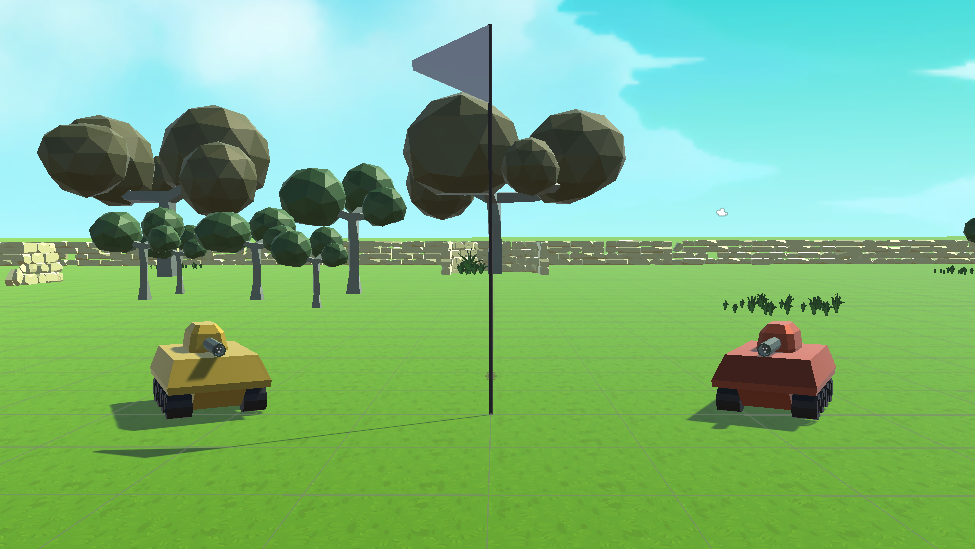
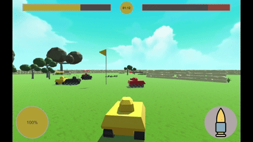
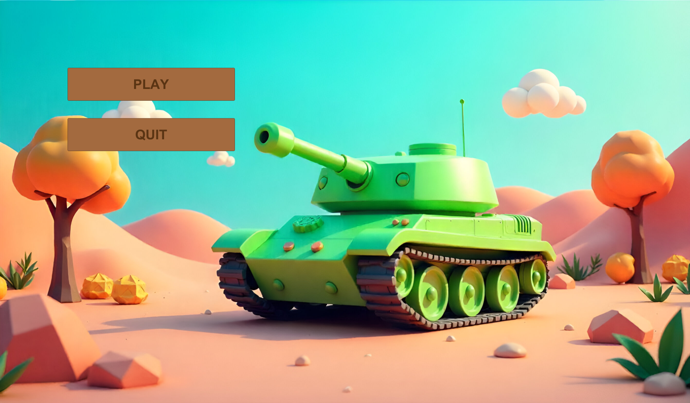
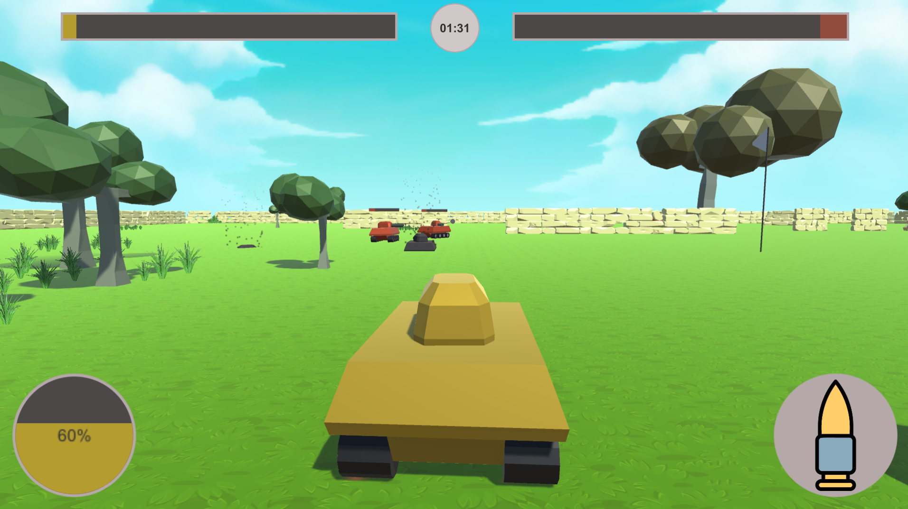
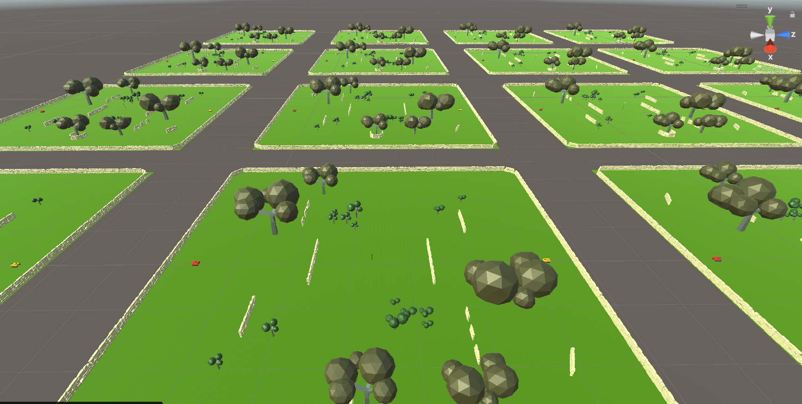
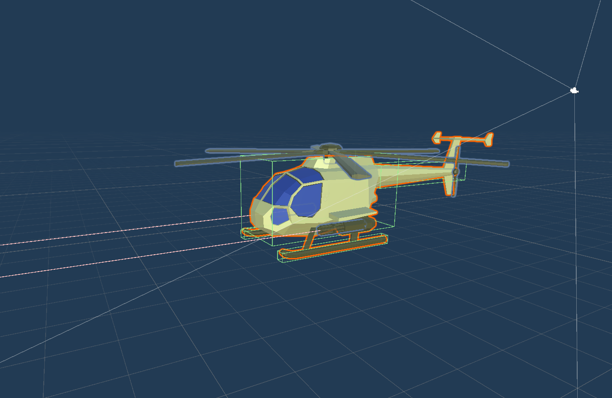
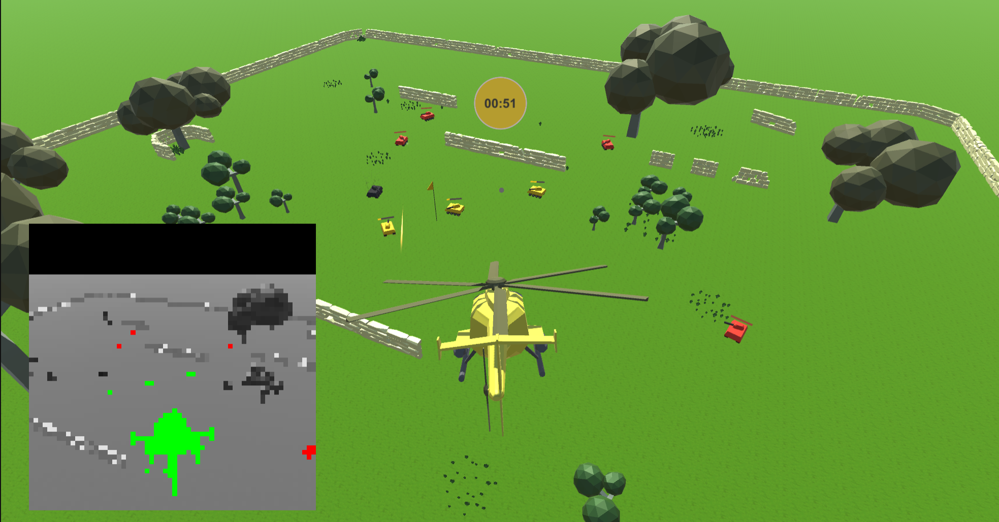

# AI-Warfare

**A low poly game where AI agents (trained using reinforcement learning) fight against each other by controlling tanks, helicopters and other combat vehicles.**

    

## What's this game about?
In AI-Warfare there are 2 teams (each with 5 vehicles) facing each other in the battlefield with 2 goals in mind:
- Capture and hold the control point located in the middle of the map
- Destoy the enemy vehicles without mercy :smiling_imp:

Doing both these things in a coordinated manner, playing as a team. Nothing you haven't seen before.
**But in this case, the vehicles are controlled by actual neural networks trained using reinforcement learning!**
Every agent featured in this game were trained for hours or even days so they could compete in an actual human player's level (*with more or less success since I'm still new in this field :sweat_smile:*)

You, as the player have the opportunity to jump in on the battlefield by controlling one of the vehicles and going for the win with your AI teammates.

## Current features
- Functional game with a main menu, end of match screens and simplistic GUI (*Although the game is mostly for demonstrating the agent's skills at this point.*)
- Trained tank controlling RL agent for 5v5 matches
- Helicopter vehicle fully integrated to the project and usable by the player (Training the model for it is in progress)
- Simple low-poly appearance with particle systems and self-made models only

## Screenshots
- Game menu  

- Gameplay  

- 1v1 pre-training environment for the tank agent  

- Helicopter agent prefab  

- Helicopter in action (The little screen at the bottom left shows how the agent perceives the environment through visual observation)  

## Future plans
- More vehicles :helicopter: (healing drone etc...)
- More maps & gamemodes :sunrise_over_mountains:
- Giving orders to AI teammates :pushpin: (follow the player for example)
- **End goal: 1v1 tactical multiplayer game where the players are the "commanders"**

## Notes
- **The project is under development and the current state is far from being done**
- Training the agents require a wastly different setup than the actual gameplay. Because of this, the dev and training branches are not the cleanest sometimes :sweat_smile: . But I'm trying to keep a clean version of the project in the main branch.
- The actual development of the project takes place in the dev branch, the training branch only exists so that I can keep track of previous (somewhat successful) training attempts.
- Currently the project can only be built with the Unity editor.
- If you want to know more about how I trained the agent's, you can check out the [hungarian documentation](./Documentation/doc_hun.pdf).